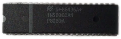
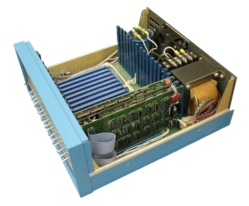
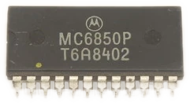
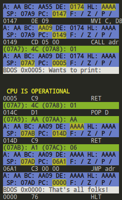

# Buddy8800 -- An Altair 8800 S-100 Emulator

**An Intel 8080 emulated on an S-100 bus with a Motorola 6850 ACIA serial expansion card. Designed for running BASIC and CP/M over a PTY.**

### Getting Started

+ **[Doxygen Documentation](https://magnetrwn.github.io/buddy8800)**
+ [Building](#building)
+ [Resources and Documentation](#resources-and-documentation)
+ [Screenshots](#screenshots)

### Doxygen Documentation

You can view the [Doxygen documentation](https://magnetrwn.github.io/buddy8800), which includes this README but much more descriptive content.

### Building

+ Make sure you have installed CMake on your system.
+ Clone the repository and navigate to the root directory.
+ **Optional for testing:** Either install Catch2 globally or run `git submodule update --init --recursive` to add it as a git submodule.
+ Run `./build.sh` from the root directory. Some flags are listed next.
+ The final executable will be placed in the `bin/` directory.

By default, the build script will output a release build that has no tracing and with high optimization. To customize this behavior, some flags are available:

| Short&nbsp;Flag | Long&nbsp;Flag           | Action | Default |
|------------|---------------------|--------|------------|
| `-d`       | `--debug`           | Output a debug build, keeping symbol labels and disabling optimization |  |
| `-r`       | `--release`         | Output a release build, enabling optimization | Enabled |
|            | `--trace`           | Enable tracing, outputting information about the emulator's state after each instruction |  |
|            | `--trace-essential` | Enable tracing only for the listing of executed instructions, not the full state |  |
| `-T`       | `--tests`           | Build with tests enabled, compiling and running the Catch2 tests through CTest |  |
| `-P`       | `--perf-stat`       | Run performance metrics at the end of the build, then show the results. |  |
|            | `--perf-report`     | Run performance metrics and let the user browse detailed results. |  |
| `-V`       | `--memcheck`        | Run Valgrind's Memcheck tool on the final executable. |  |

Development builds are usually compiled with `./build.sh -d -T`.

### Resources and Documentation

Here are some of the resources I used to figure out various aspects of this project

**Overview**

+ [Wikipedia/Altair 8800](https://en.wikipedia.org/wiki/Altair_8800), a general overview.
+ [Making an Emulator: Space Invaders on the Intel 8080](https://www.youtube.com/watch?v=7kf70nhor24), while not directly related, this video has in-depth information on handling an Intel 8080 system's memory map and interrupts.

**Intel 8080**

+ [Wikipedia/Intel 8080](https://en.wikipedia.org/wiki/Intel_8080), general Intel 8080 info, with an unexpectedly good layout for opcodes.
+ [Emulator101](http://www.emulator101.com/) and [Emulator101/Opcode List](http://www.emulator101.com/reference/8080-by-opcode.html), a great resource for understanding the basics of emulation, with a comprehensive opcode list.
+ [Emulator101/cpudiag.bin](http://www.emulator101.com/files/cpudiag.bin), a diagnostic program for the Intel 8080, which was used throughout development for testing.
+ [space-invade.rs/cpudiag.lst](https://github.com/cbeust/space-invade.rs/blob/main/emulator/cpudiag.lst), a very useful listing of the assembled `cpudiag.bin` program.
+ [Altair Clone/Programmers Manual](https://altairclone.com/downloads/manuals/8080%20Programmers%20Manual.pdf), very useful for understanding how opcodes run and patterns in the instruction set.
+ [Auxiliary Carry and the Intel 8080's logical instructions](https://retrocomputing.stackexchange.com/questions/14977/auxiliary-carry-and-the-intel-8080s-logical-instructions), a very specific question that fixed diagnostics failing and is not very easy to find.
+ [How do interrupts work on the Intel 8080?](https://stackoverflow.com/questions/2165914/how-do-interrupts-work-on-the-intel-8080).

**Altair 8800**

+ [S100Computers](http://www.s100computers.com/index.html), a comprehensive collection of hardware information on S-100 systems.
+ [What additional hardware was required for BASIC on an Altair 8800](https://retrocomputing.stackexchange.com/questions/14675/what-additional-hardware-was-required-for-basic-on-an-altair-8800), a very nice explanation of how Altair 8800 systems originally shipped.
+ [Why 18 expansion slots on the Altair 8800?](https://retrocomputing.stackexchange.com/questions/24117/why-18-expansion-slots-on-the-altair-8800).
+ [Intel 8080 and Altair 8800. 256 I/O ports, but only 7 free RST (interrupt subroutines) — how does it work?](https://retrocomputing.stackexchange.com/questions/6849/intel-8080-and-altair-8800-256-i-o-ports-but-only-7-free-rst-interrupt-subrou?rq=1), a good explanation of how the Altair 8800's I/O ports and interrupts work.

**Motorola 6850 ACIA**

+ [This Slide](https://ocw.ump.edu.my/pluginfile.php/423/mod_resource/content/1/Chapter%2013.pdf) provides a general overview in a neat format, but not very in-depth.
+ [Motorola 6850 ACIA Datasheet](https://www.cpcwiki.eu/imgs/3/3f/MC6850.pdf), the original datasheet for the Motorola 6850 ACIA.
+ [Motorola 6850 ACIA](http://beyondbrown.d-bug.me/post/motorola-mc6850-acia/), a partial OCR of the datasheet.

**CP/M**

+ [Why did CP/M require RAM in the bottom part of the address space](https://retrocomputing.stackexchange.com/questions/6442/why-did-cp-m-require-ram-in-the-bottom-part-of-the-address-space) as well as [Test emulated 8080 CPU without an OS](https://retrocomputing.stackexchange.com/questions/9361/test-emulated-8080-cpu-without-an-os), some good information on CP/M memory maps and execution.

**Software**

+ [skx/cpm-dist](https://github.com/skx/cpm-dist), some very cool software for CP/M.
+ [jefftranter/8080](https://github.com/jefftranter/8080), more software, multiple monitor programs.
+ [beriddle/i8080](https://github.com/beriddle/i8080), some demos for the Orion-128 Russian 8080 clone machine, but includes an interesting [16 bit floating point library](https://github.com/beriddle/i8080/tree/master/FP16).
+ [skx/cpmulator](https://github.com/skx/cpmulator/tree/master/ccp), useful CCP sources and binaries.

And most of all, thank you to the **Emulator Development** and **Lazy Developers** Discord servers for all the help and support!

### Screenshots

**First Contact!**

