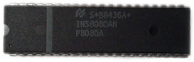
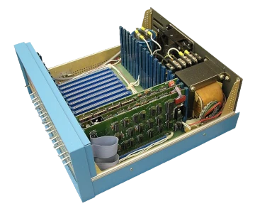
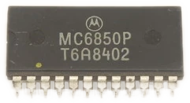

# Buddy8800 -- An Altair 8800 S-100 Emulator

**An Intel 8080 emulated on an S-100 bus with a Motorola 6850 ACIA serial expansion card. Designed for running BASIC and CP/M over a PTY.**


### Getting Started

+ **[Doxygen Documentation](https://magnetrwn.github.io/buddy8800)**
+ [Building](#building)
+ [Running from CLI](#running-from-cli)
+ [Configuration File](#configuration-file)
+ [Resources and Documentation](#resources-and-documentation)
+ [Additional Information](#additional-information)

### Doxygen Documentation

You can view the [Doxygen documentation](https://magnetrwn.github.io/buddy8800), which includes this README but much more descriptive content.

### Building

+ Make sure you have installed CMake on your system.
+ Clone the repository and navigate to the root directory.
+ Run `git submodule update --init --recursive` to fetch `Catch2` (v3) and `toml11`.
+ Run `./build.sh` from the root directory. Some flags are listed next.
+ The final executable will be placed in the `bin/` directory.

By default, the build script produces an optimized release build with the ncurses frontend. To customize this behavior, some flags are available:

| Short&nbsp;Flag | Long&nbsp;Flag           | Action | Default |
|------------|---------------------|--------|------------|
| `-d`       | `--debug`           | Output a debug build, keeping symbol labels and disabling optimization |  |
| `-r`       | `--release`         | Output a release build, enabling optimization | Enabled |
|            | `--disable-trace`   | Build the plain frontend without ncurses or instruction tracing |  |
| `-T`       | `--tests`           | Build with tests enabled, compiling and running the Catch2 tests through CTest |  |
| `-P`       | `--perf-stat`       | Run performance metrics at the end of the build, then show the results. |  |
|            | `--perf-report`     | Run performance metrics and let the user browse detailed results. |  |
| `-V`       | `--memcheck`        | Run Valgrind's Memcheck tool on the final executable. |  |

Development builds are usually compiled with `./build.sh -d -T`.

**Note:** Make sure you have `config.toml` placed in the same directory as the final executable. This file contains the configuration for the emulator, such as what cards to place and where.

### Running from CLI

You can either call the emulator from CLI passing pairs of file locations for ROMs and their load addresses, or set these loads directly in the configuration file for a more permanent solution. While you can load from the CLI, the config file will still need to contain information about what cards the system is setup with, in fact you could load these ROMs' data into address ranges belonging to any memory device in the system (not I/O since it belongs to a separate address space where an I/O request signal is detected).

```shell
bin/buddy8800 your/path/to/rom100.bin 0x100 your/path/to/rom7F00.bin 0x7F00 ...
```

Is equivalent (see **Note**) to:

```toml
[emulator]
...
start_with_pc_at    = 0x0100
...

[[card]]
slot        = 3
type        = "rom"
at          = 0x0100
load        = "your/path/to/rom100.bin"

[[card]]
slot        = 4
type        = "rom"
at          = 0x7F00
load        = "your/path/to/rom7F00.bin"
```

**Note:** The first pair of ROM and address provided by the CLI will generate a few reset vector instruction in the zero page to jump to the first loaded ROM. The config file allows you to specify the starting address for the program counter, which is **not the same as the reset vector** as it directly sets PC to the specified address, skipping the reset vector. Because of this, be wary of having a value in the config file when trying to load a ROM from the CLI, as the emulator will give priority to the config file provided PC value.

For loading from CLI, the size (`range`) of the data cards must be determined in the config file, while if using the `load` field in the config file, the size will be determined by the size of the binary to load. **You can also use them both at the same time, filling the extra with** `0xFF` **bytes, but using a range value smaller than the binary size will cause an exception.** Here is an example of specifying `range`, while using the CLI to load the data:

```toml
[[card]]
slot        = 10
type        = "rom"
at          = 0x0100
range       = 2048
```

```shell
bin/buddy8800 your/path/to/rom100.bin 0x100
```

Note that this will not check if the binary file is too large (more than 2048 bytes) for the specified range, and in which case will just continue writing to other cards in the system, which is expected behavior. The CLI loading utility allows you to load data in any range of memory as it serves exactly that purpose, even after having loaded a file already from a config file.

Much of this information is also immediately reported upon running the emulator during setup phase, allowing you to quickly see if the loaded configuration is correct.

### Configuration File

Please check the highly descriptive [config.toml](static/config.toml) file for a full list of options and their descriptions. The configuration file is used to specify the system's setup, such as what cards are placed in the system and where, as well as the initial state of the emulator.

For reference, here is a simple test machine setup (only the cards portion of the config file):

```toml
[[card]] # 88-SIO serial interface
slot        = 10
type        = "serial"
at          = 0x10

[[card]] # Diagnostics II expects to be loaded in RAM
slot        = 3
type        = "ram"
at          = 0x0100
load        = "tests/res/diag2.com"

[[card]] # Cover all memory space with RAM just in case
slot        = 4
type        = "ram"
at          = 0x0000
range       = 65536
let_collide = true
```

### Resources and Documentation

Here are some of the resources I used to figure out various aspects of this project

**Overview**

+ [Wikipedia/Altair 8800](https://en.wikipedia.org/wiki/Altair_8800), a general overview.
+ [Making an Emulator: Space Invaders on the Intel 8080](https://www.youtube.com/watch?v=7kf70nhor24), while not directly related, this video has in-depth information on handling an Intel 8080 system's memory map and interrupts.

**Intel 8080**



+ [Wikipedia/Intel 8080](https://en.wikipedia.org/wiki/Intel_8080), general Intel 8080 info, with an unexpectedly good layout for opcodes.
+ [Emulator101](http://www.emulator101.com/) and [Emulator101/Opcode List](http://www.emulator101.com/reference/8080-by-opcode.html), a great resource for understanding the basics of emulation, with a comprehensive opcode list.
+ [Emulator101/cpudiag.bin](http://www.emulator101.com/files/cpudiag.bin), a diagnostic program for the Intel 8080, which was used throughout development for testing.
+ [space-invade.rs/cpudiag.lst](https://github.com/cbeust/space-invade.rs/blob/main/emulator/cpudiag.lst), a very useful listing of the assembled `cpudiag.bin` program.
+ [Altair Clone/Programmers Manual](https://altairclone.com/downloads/manuals/8080%20Programmers%20Manual.pdf), very useful for understanding how opcodes run and patterns in the instruction set.
+ [Auxiliary Carry and the Intel 8080's logical instructions](https://retrocomputing.stackexchange.com/questions/14977/auxiliary-carry-and-the-intel-8080s-logical-instructions), a very specific question that fixed diagnostics failing and is not very easy to find.
+ [How do interrupts work on the Intel 8080?](https://stackoverflow.com/questions/2165914/how-do-interrupts-work-on-the-intel-8080).

**Altair 8800**



+ [S100Computers](http://www.s100computers.com/index.html), a comprehensive collection of hardware information on S-100 systems.
+ [What additional hardware was required for BASIC on an Altair 8800](https://retrocomputing.stackexchange.com/questions/14675/what-additional-hardware-was-required-for-basic-on-an-altair-8800), a very nice explanation of how Altair 8800 systems originally shipped.
+ [Why 18 expansion slots on the Altair 8800?](https://retrocomputing.stackexchange.com/questions/24117/why-18-expansion-slots-on-the-altair-8800).
+ [Intel 8080 and Altair 8800. 256 I/O ports, but only 7 free RST (interrupt subroutines) — how does it work?](https://retrocomputing.stackexchange.com/questions/6849/intel-8080-and-altair-8800-256-i-o-ports-but-only-7-free-rst-interrupt-subrou?rq=1), a good explanation of how the Altair 8800's I/O ports and interrupts work.

**Motorola 6850 ACIA**



+ [This Slide](https://ocw.ump.edu.my/pluginfile.php/423/mod_resource/content/1/Chapter%2013.pdf) provides a general overview in a neat format, but not very in-depth.
+ [Motorola 6850 ACIA Datasheet](https://www.cpcwiki.eu/imgs/3/3f/MC6850.pdf), the original datasheet for the Motorola 6850 ACIA.
+ [Motorola 6850 ACIA](http://beyondbrown.d-bug.me/post/motorola-mc6850-acia/), a partial OCR of the datasheet.

**CP/M**

+ [Why did CP/M require RAM in the bottom part of the address space](https://retrocomputing.stackexchange.com/questions/6442/why-did-cp-m-require-ram-in-the-bottom-part-of-the-address-space) as well as [Test emulated 8080 CPU without an OS](https://retrocomputing.stackexchange.com/questions/9361/test-emulated-8080-cpu-without-an-os), some good information on CP/M memory maps and execution.

**Software**

+ [skx/cpm-dist](https://github.com/skx/cpm-dist), some very cool software for CP/M.
+ [jefftranter/8080](https://github.com/jefftranter/8080), more software, multiple monitor programs.
+ [beriddle/i8080](https://github.com/beriddle/i8080), some demos for the Orion-128 Russian 8080 clone machine, but includes an interesting [16 bit floating point library](https://github.com/beriddle/i8080/tree/master/FP16).
+ [skx/cpmulator](https://github.com/skx/cpmulator/tree/master/ccp), useful CCP sources and binaries.

And thank you to the **Emulator Development** and **Lazy Developers** Discord servers for general help and support!

### Additional Information

I decided to dig back this project from being abandoned to get GPT-6 Astra to fix a bug with the PTY I couldn't spend time to look for. The following are updates from the agent with my guidance.

```
The build requires a C++17 compiler, CMake, and the ncurses development library; tests additionally require Python 3
(standard library only). It uses `build-linux/` (`BUDDY8800_BUILD_DIR` can override
it). Documentation is optional via `--docs`.
You can also run `cmake -S . -B build-linux -DENABLE_TESTING=ON`,
`cmake --build build-linux -j8`, and `ctest --test-dir build-linux --output-on-failure`.
CMake prepares the config and monitor in `bin/`; the executable works from any
working directory. Use `bin/buddy8800 --config /path/to/config.toml` for another machine.
Paths in a config's `load` fields resolve relative to that config file;
CLI binary paths resolve relative to the current working directory.

In a terminal, startup opens three ncurses panels and pauses before the first
instruction. The upper panel shows the machine and cards, including each serial
card's `/dev/pts/N` path. The lower left panel scrolls executed instruction addresses,
opcode bytes, operands and mnemonics; the lower right updates registers and flags
in place, highlighting changes in bold. Connect with `screen /dev/pts/N 19200`
from another terminal, then press Space in the emulator to run.

Controls: Space runs/pauses, `s` steps one instruction and pauses, `x` toggles
both lower panels, `q` quits,
Page Up/Page Down browse instruction history (Page Up pauses), and Up/Down scroll
the machine information. History retains the latest 2,048 lines. The display
updates at about 30 Hz; execution is batched, so fast-running code scrolls past
between frames. Pause or step to inspect individual instructions. HLT leaves
the final state visible until you quit. With reporting disabled via `x`, both
lower panels show only a disabled message. Execution uses a specialization with
instruction trace code compiled out, without the traced frontend's instruction
cap or sleep. The machine panel and controls remain responsive (about every
33 ms). This toggles reporting only: a paused CPU stays paused, and a running
CPU keeps running. Press `x` again to resume live reporting; old history is cleared
so instructions skipped during fast execution are not presented as continuous.
Pseudo-BDOS console capture is also suppressed while reporting is disabled;
serial PTY traffic is unaffected. See [performance notes](tools/performance.md).
Resizing below 76 columns by 18 rows
pauses execution until you enlarge the terminal and resume.

`./build.sh --disable-trace` or CMake's `-DDISABLE_TRACE=ON` builds the plain
frontend, which prints card information and runs immediately without ncurses.
`DISABLE_TRACE` defaults to OFF. Redirected stdin or stdout also selects the
plain frontend automatically, preserving headless operation and test harnesses.
The former two trace build options have been removed.

The PTY preserves startup output and permits disconnect/reconnect. Ctrl-C in the
emulator's own terminal or SIGTERM stops it and restores terminal settings;
Ctrl-C sent over the PTY belongs to the guest.

ALTMON displays `ALTMON 1.3` and a `*` prompt. Try typing `K200020035A` to fill
four RAM bytes, then `D20002003` to dump them. The monitor inserts spaces itself:
do not type spaces or Return. ESC cancels a command. See the bundled
[monitor manual](static/Altair%20Monitor%20Info.pdf) for other commands.

The supplied `static/f800mon.bin` is 1,031 bytes, including real code beyond
the first KiB. The default machine maps all of it as ROM at F800–FC06, with
RAM underneath and one polled 2SIO channel at ports 10/11. Its command-table base
byte is already repaired (offset 003B: 81 → C1); the build copies the checked-in
image unchanged into `bin/` alongside the default config. FC00 is therefore not
available for another ROM. See [the image notes](static/f800mon.md) for the repair.

Monitor tests use their own [pinned config and ROM](tests/fixtures/altmon/README.md),
passed explicitly through `--config`. They do not depend on `bin/config.toml` or
the distributable ROM. This keeps ALTMON regression coverage stable as other boot
configurations, such as BASIC 4K, are added. ALTMON remains the distributable default;
the executable selects other machines through `--config`.

Serial transport is raw and eight-bit clean, with one receive register and one
pending transmit byte. Guests must poll readiness; transmit backpressure never
blocks the CPU. The card information shows the configured clock and divider
(for example, `clock: 19200 Hz /16 (unpaced)` after ALTMON starts), rather than
an active baud rate. Guest control writes do not change the host PTY's nominal
speed or throttle transport. Clock/framing controls are retained as guest state; baud timing,
modem signals and UART interrupts are not emulated. Add another serial card at
0x12 for a separate PTY if needed. This setup does not include the disk hardware
or software needed to boot CP/M.
```
